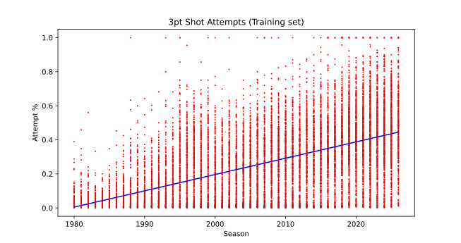

This repo for currently just for testing out and keeping track of my ML learning projects

## Linear Regression
### NBA 3pt shot attempt %

Each red dot is a player, and the chart shows their total 3 point attempt % (of all shots taken). The linear regressional model tells us there's been around a 40% increase in 3 point attempts since 1980 to 2026.

## Logistic Regression
### NBA 3pa & pts to playoff

In this next graph the data was only used from the 2001 season, since this was when the "No zone defense" rule was put in place. We can see that teams who take more 3pa's usually score higher than teams that score less. But interestingly, the biggest concentration of teams that make the finals (represented by blue dots) are on the lower side of the graph - telling us that shooting 3 pointers is not the most important skill to win games.

